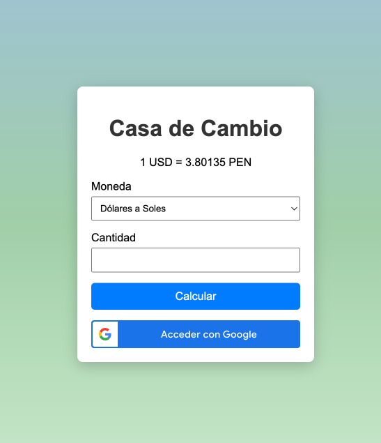

# Taller de Programación Web

**Alumno:** Fabrizio Ordoñez - U20238081

**Aplicación:** Casa de Cambio

**Entrega:** Tercer Avance



### Requisitos:
Para correr el proyecto se necesita:
- **PHP 8.3**
- **MySQL**
- Cuenta en Google
- Composer (opcional)

### Instalación:

- Para instalar el proyecto, clonar el repositorio o descargar el zip y descomprimirlo.
  - _Si se clonó el repositorio desde git, ejecutar `composer install` para descargar e instalar las dependencias._
- Editar el archivo `.env` para configurar las credenciales de la base de datos local.
- Ejecutar el script SQL que se encuentra en `scripts/create_users_table.sql` para crear la tabla de usuarios en MySQL.
- Correr el servidor embebido de PHP con el siguiente comando:
```bash
php -S localhost:8080 -t public/
```
- Abrir la dirección http://localhost:8080 en el navegador web y probar la aplicación

